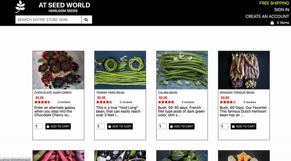
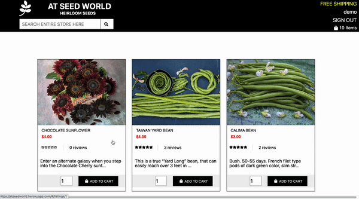
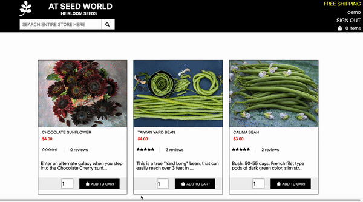

# ATSeedWorld

## Background
[ATSeedWorld](https://atseedworld.herokuapp.com/#/) is the site where the customers can purchase seeds. The customer can add seed to the cart, edit and delete the items in their cart. The customer can also review and rate the seeds. They also can search for the seeds they want to purchase. The customer can login, create account and also there is a demo user button that allows the customer to access functions such as reviewing, rating the products and adding, editing or deleting the items in the bucket without having to login or create account. 

## Technologies

🥬 Ruby on Rails

🥬 React/Redux

🥬 PostgreSQL

🥬 JavaScript/AJAX/JBuilder

🥬 HTML/CSS

🥬 AWS / AMAZON S3-Image Storage

## Features

* ### User account create and login

* ### Review and Rate the products

* ### Add items to the basket

* ### Search for items via search bar

